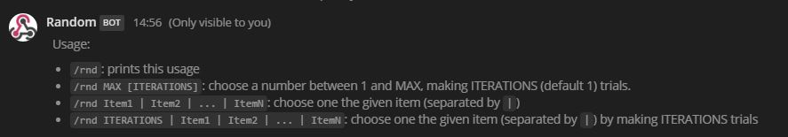
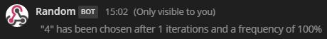
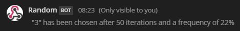
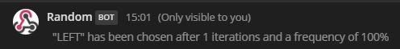
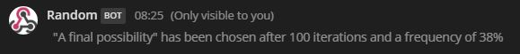

# RandomOnFire
[](https://travis-ci.org/McFoggy/RandomOnFire)

Backend code for powering a Mattermost [slash command](https://docs.mattermost.com/developer/slash-commands.html) that allow to randomize some choices.
Can be used in place a dice, or to make random choices between different proposals.

This project has been greatly inspired by [Jed Fonner](https://github.com/jedfonner) work on his [vote/poll application](https://github.com/jedfonner/MattermostOnFire) for Mattermost.  

## What does this do?

By calling a `/rnd` slash command


You can:

- launch a dice one time: `/rnd 6`
  
- or launch the dice 50 times: `/rnd 6 50`  
  
- decide to go left or right: `/rnd LEFT | RIGHT`  
  
- make a choice between several possibilities over a defined number of trials: `/rnd 100 | One Choice | Another one | A final possibility`  
  


## Set up
Setting this up requires doing some initial Firebase setup, then doing some initial Mattermost setup, then wiring the two systems together.

### Initial Firebase Setup
1. Create a new project in Firebase
1. Clone this repo to a new local folder and `cd` into the new folder
1. Run `cd functions && npm install`
1. Run `firebase login`
1. Run `firebase use --add` and select the Firebase project you created in step 1.
1. Go to your Firebase project settings and note the "Project ID". Your Functions' base url will be `https://us-central1-PROJECTID.cloudfunctions.net` (replace PROJECTID with your Project ID)
1. Set the Firebase Functions base url (e.g., https://us-central1-PROJECTID.cloudfunctions.net) as a Firebase environment variable by running `firebase functions:config:set functions.baseurl="your functions base url"` (starting with https:// and ending without a trailing slash)

### Initial Mattermost Setup
1. Create a new Slash command in Mattermost (I suggest calling it something short, like "rnd")
1. Select "POST" for Request Method
1. Fill in a dummy Request URL for now, we'll come back and change this in a bit.
1. Fill out the rest of the Slash command configuration as you please, then save
1. Mattermost will generate a unique token for your Slash command.  Note that down.

### Finish Firebase Setup
1. Set the Mattermost token as a Firebase environment variable by running `firebase functions:config:set mattermost.token="your Mattermost token"`
1. Check your Firebase environment config by running `firebase functions:config:get` - it should look like:
```
ᐅ firebase functions:config:get
{
  "mattermost": {
    "token": "abcdefghijklmnopqrstuvwxyz"
  },
  "functions": {
    "baseurl": "https://us-central1-myprojectid.cloudfunctions.net"
  }
}
```
3. Deploy your project by running `firebase deploy`.
4. When it finishes deploying, it will log the URL for each Function. Note the "Function URL" for `slashChoices` (e.g., https://us-central1-PROJECTID.cloudfunctions.net/slashChoices)

On a single installation, if you have multiple mattermost teams and want to use the slash command on each, then you have to register several tokens (one for each slash command created).
For that you can define token to contain several command id by separating them using a comma `firebase functions:config:set mattermost.token="token1,token2,token3"`

The resulting Firebase environment config should look like:
```
ᐅ firebase functions:config:get
{
  "mattermost": {
    "token": "token1,token2,token3"
  },
  "functions": {
    "baseurl": "https://us-central1-myprojectid.cloudfunctions.net"
  }
}
```

### Finish Mattermost Setup
1. Edit your Mattermost Slash command and update the Request URL to be the URL of your Firebase Functions `slashChoices` function

🎉  ALL DONE!

### Additional configuration

As it is your choice to name the slash command in Mattermost and because we show a usage of the command, if you did not choose `rnd` as the slash command name, 
you can configure the name so that it appears correctly in the usage.  
For example, if you named the command `random`, you can configure it by executing the following command:
- `firebase functions:config:set mattermost.slash="random"` 

## Runtime Monitoring
* You can review the logs for the functions via the Functions > Logs interface of the Firebase Console
* You can introspect the data being generated via the Database interface of the Firebase Console

## Developing

### Running Locally
* See https://firebase.google.com/docs/functions/local-emulator

### Tests

launch 
- `npm test`: to execute the tests
- `npm run test:watch`: to exeecute the tests each time you do a modification in the sources
